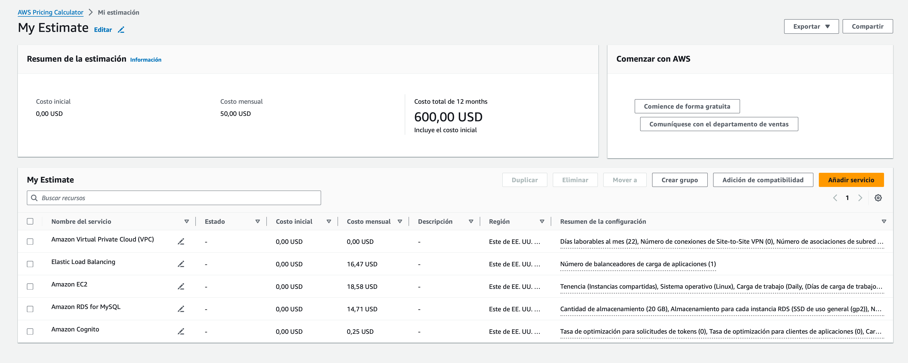

# Creación de una aplicación web escalable y de alta disponibilidad

# Autores y Centro de Estudios:

	Desarrollador: Serhiy Holovasin Suslov
	Tutora Docente: María Jesús Sánchez García
 	Centro de Estudios: IES Infanta Elena (Galapagar-Madrid)
        
# Enlaces Importantes

	•	AWS Academy Lab Project - Cloud Web Application Builder: https://awsacademy.instructure.com/courses/77796
	•	AWS Academy Cloud Foundations: https://awsacademy.instructure.com/courses/45984
	•	Enlace del Proyecto: alb-webapp-1028279269.us-east-1.elb.amazonaws.com
	•	Enlace al video y la presentacion: https://drive.google.com/drive/folders/1n9o05gLwVrH_J3RyOu4yGpDRkIGms_6r?usp=sharing

# Breve Reseña del Proyecto

Este proyecto consiste en crear una aplicación web de alta disponibilidad y escalabilidad en AWS para gestionar los expedientes de estudiantes de la Universidad. La solución incluye instancias EC2 con balanceo de carga y escalado automático, una base de datos MySQL en Amazon RDS, y AWS Secrets Manager para gestionar las credenciales de manera segura. El objetivo es garantizar que la aplicación sea accesible, rápida y segura durante los períodos de alta demanda. Se implementan prácticas recomendadas de arquitectura en la nube para lograr una infraestructura robusta, eficiente y de bajo costo.

# Objetivos

	1.	Crear un diagrama de arquitectura: Representar varios servicios de AWS y sus interacciones.
	2.	Calcular el costo: Usar AWS Pricing Calculator para estimar el costo de la solución.
	3.	Implementar una aplicación web funcional: Ejecutarla en una única máquina virtual respaldada por una base de datos relacional.
	4.	Diseñar la aplicación web: Separar las capas de la aplicación, como el servidor web y la base de datos.
	5.	Crear una red virtual segura: Configurar una VPC correctamente para alojar la aplicación web.
	6.	Implementar balanceo de carga y escalabilidad: Distribuir la carga entre varios servidores web.
	7.	Configurar seguridad de red: Proteger los servidores web y la base de datos.
	8.	Implementar alta disponibilidad y escalabilidad: Garantizar un tiempo de inactividad limitado y adaptar la solución a la demanda.
	9.	Configurar permisos de acceso: Gestionar los permisos entre los servicios de AWS.

Estos objetivos asegurarán que la aplicación web cumpla con los requisitos de funcionalidad, seguridad, rendimiento y costos óptimos.

# Diagrama de interconexión de los servicios AWS

Los usuarios acceden a la aplicación web desde sus navegadores a través de Internet. Las solicitudes de los clientes son dirigidas a la URL del Application Load Balancer (ALB), que actúa como el punto de entrada a la arquitectura. El ALB se encarga de recibir las solicitudes entrantes y distribuirlas equitativamente entre las instancias EC2 desplegadas en las subredes públicas. Este balanceo de carga asegura que ninguna instancia EC2 se sobrecargue, manteniendo la alta disponibilidad y el rendimiento de la aplicación. Un grupo de seguridad asociado al ALB permite el tráfico entrante en el puerto 80 (HTTP)

Las instancias EC2 alojan la aplicación web y procesan las solicitudes recibidas del ALB. Estas instancias ejecutan el código de la aplicación, gestionando las operaciones solicitadas por los usuarios, como ver, añadir, eliminar o modificar registros de estudiantes. Las instancias EC2 están configuradas en un Auto Scaling Group, que ajusta automáticamente el número de instancias en función de la demanda, asegurando que siempre haya suficientes recursos disponibles para manejar el tráfico de la aplicación. Un grupo de seguridad para las instancias EC2 permite el tráfico entrante solo desde el ALB en el puerto 80 (HTTP) y el tráfico SSH solo desde direcciones IP específicas para administración.

Para las operaciones que requieren acceso a datos persistentes, las instancias EC2 se comunican con una base de datos MySQL alojada en Amazon RDS. La base de datos RDS está desplegada en subredes privadas para mayor seguridad y solo permite conexiones desde las instancias EC2 autorizadas. AWS Secrets Manager se utiliza para gestionar las credenciales de la base de datos de manera segura, proporcionando a las instancias EC2 acceso seguro a los secretos necesarios para conectarse a RDS. El grupo de seguridad para RDS permite el tráfico entrante solo desde los grupos de seguridad asignados a las instancias EC2 en el puerto 3306 (MySQL).

Además, Amazon Cognito se utiliza para la autenticación y gestión de usuarios, aunque su implementación completa queda fuera del alcance del POC. Cognito facilita la creación de un sistema de autenticación robusto y seguro para la aplicación web, gestionando las credenciales de los usuarios y proporcionando características avanzadas de seguridad.

Finalmente, AWS Identity and Access Management (IAM) gestiona los permisos y roles necesarios para que los servicios interactúen de manera segura. Roles como LabRole se asignan a las instancias EC2 para permitirles acceder a los secretos gestionados por AWS Secrets Manager y otros recursos necesarios. Este enfoque asegura que cada componente de la arquitectura tenga los permisos mínimos necesarios para funcionar, siguiendo las mejores prácticas de seguridad de AWS.

# Servicios AWS Empleados

	VPC
	Amazon EC2
	Amazon RDS
	Amazon Cloud9
 	AWS IAM
	AWS Secret Manager 
	Application Load Balancer
	Grupos de seguridad
	Target group
	Auto-scaling
	

# Resumen de estimación de costos

Para mas informacion ver el documento adjuntado "My Estimate"

# Documentación de la Arquitectura

Toda la documentación esta incuida en el pdf adjuntado "LAB_Project_SerhiyHolovasin.pdf"

# Evaluación del Cumplimiento de los Objetivos

1. Funcionalidad: La aplicación cumple con los requisitos funcionales, permitiendo ver, añadir, eliminar y modificar los registros de los estudiantes sin retrasos perceptibles bajo cargas normales.

2. Balanceo de Carga: La solución implementa un ALB que equilibra adecuadamente el tráfico de usuarios.

3. Escalabilidad: La configuración de Auto Scaling asegura que la aplicación pueda adaptarse a la demanda.

4. Alta Disponibilidad: La arquitectura, que incluye múltiples zonas de disponibilidad y un ALB, asegura un tiempo de inactividad limitado.

5. Seguridad: Se implementaron grupos de seguridad y AWS Secrets Manager para proteger los recursos y credenciales de la base de datos.

6. Optimización de Costos: La solución está diseñada para mantener los costos bajos mediante el uso de instancias y servicios de AWS eficientes.

7. Alto Rendimiento: Las pruebas de carga confirmaron que la aplicación puede manejar grandes volúmenes de tráfico, aunque se identificaron áreas para optimización adicional.

El proyecto ha cumplido con éxito los objetivos planteados, diseñando e implementando una arquitectura de alta disponibilidad y escalabilidad en AWS para una aplicación web de registros de estudiantes. Se lograron configuraciones de balanceo de carga, autoescalado y seguridad robusta, asegurando que la aplicación pueda manejar eficientemente el tráfico esperado durante los períodos de mayor demanda.

# Conclusión

El proyecto de creación de una aplicación web de alta disponibilidad y escalabilidad en AWS ha sido un éxito, cumpliendo con todos los objetivos planteados. A través de este proyecto, hemos aprendido a diseñar e implementar una arquitectura robusta y eficiente utilizando una variedad de servicios de AWS, lo que nos ha permitido adquirir habilidades clave en la gestión y optimización de aplicaciones en la nube.

Aprendizajes Clave

1. Diseño y Planificación de Arquitecturas en la Nube:

Hemos aprendido a crear diagramas de arquitectura que representan la interacción entre varios servicios de AWS, como VPC, subredes, EC2, RDS, ALB y Auto Scaling. Este conocimiento es fundamental para diseñar soluciones escalables y de alta disponibilidad en cualquier entorno de nube.

2. Configuración y Gestión de Redes Virtuales:

La configuración de una VPC con subredes públicas y privadas, gateways de Internet y tablas de enrutamiento nos ha permitido comprender cómo segmentar y asegurar el tráfico de red dentro de AWS. Estas habilidades son esenciales para la creación de entornos de red seguros y eficientes.

3. Despliegue y Gestión de Aplicaciones Web:

Aprendimos a lanzar instancias EC2, instalar aplicaciones web y configurar bases de datos relacionales utilizando Amazon RDS. Además, la utilización de AWS Secrets Manager para gestionar credenciales de forma segura nos ha enseñado prácticas recomendadas de seguridad en la gestión de secretos.

4. Implementación de Balanceo de Carga y Auto Scaling:

La configuración de un Application Load Balancer (ALB) y un grupo de Auto Scaling nos ha proporcionado conocimientos prácticos sobre cómo distribuir la carga de tráfico y escalar automáticamente los recursos según la demanda. Esto es importante para mantener el rendimiento y la disponibilidad de las aplicaciones en entornos de producción.

5. Pruebas de Rendimiento y Optimización:

Realizar pruebas de carga con herramientas como loadtest nos ha permitido evaluar el rendimiento de la aplicación bajo condiciones de alta demanda. Aprendimos a monitorear y ajustar las configuraciones de Auto Scaling y a identificar áreas para optimización adicional, asegurando que la aplicación pueda manejar grandes volúmenes de tráfico de manera eficiente.

Aplicaciones Futuras

Las habilidades y conocimientos adquiridos durante este proyecto son aplicables a una amplia variedad de escenarios y entornos. En el futuro, podremos aplicar estas técnicas y mejores prácticas en diferentes contextos, tales como:

1. Desarrollo de Aplicaciones Empresariales: Implementar arquitecturas escalables y de alta disponibilidad para aplicaciones críticas que requieren un rendimiento y una disponibilidad óptimos.

2. Migración a la Nube: Ayudar a las organizaciones a migrar sus aplicaciones y servicios a AWS, asegurando que las nuevas arquitecturas sean seguras, eficientes y escalables.

3. Optimización de Costos: Utilizar servicios de AWS de manera eficiente para mantener los costos bajos mientras se maximiza el rendimiento y la disponibilidad de las aplicaciones.

4. Gestión de Seguridad en la Nube: Implementar prácticas avanzadas de seguridad, como la gestión de secretos y la configuración de políticas de acceso, para proteger los recursos en la nube.

En conclusión, este proyecto no solo ha demostrado nuestra capacidad para construir una solución técnica sólida en AWS, sino que también ha ampliado significativamente nuestras competencias en la gestión de aplicaciones en la nube. Las habilidades adquiridas serán invaluables para abordar futuros desafíos y oportunidades en el ámbito de la informática en la nube.

© 2024, Amazon Web Services, Inc. o sus filiales. Todos los derechos reservados.

# Contacto

serhiy.holovasin@educa.madrid.org 
ispansergio@gmail.com