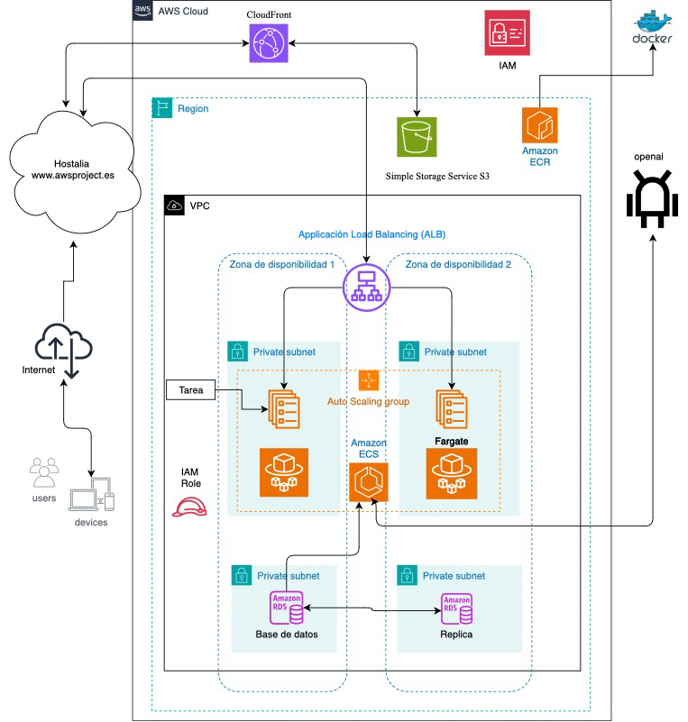

# Implementación de un ChatBot Educativo en AWS

# Autores y Centro de Estudios:

	Desarrollador: Serhiy Holovasin Suslov
	Tutora Docente: María Jesús Sánchez García
 	Centro de Estudios: IES Infanta Elena (Galapagar-Madrid)
        

# Descripción del Proyecto

Este proyecto demuestra la implementación de un chatbot educativo desplegado en AWS, diseñado para mejorar la comunicación entre estudiantes, profesores y padres en el entorno educativo. Utiliza tecnologías avanzadas para responder a consultas en tiempo real, ofreciendo una plataforma accesible las 24 horas del día.

# Enlaces Importantes

	•	AWS Academy Learner Lab: https://awsacademy.instructure.com/courses/77797
	•	AWS Academy Cloud Foundations: https://awsacademy.instructure.com/courses/45984
	•	Enlace del Proyecto: https://awsproject.es
	•	Enlace de la presentacion completa del proyecto: https://youtu.be/OX2-mOVbnts 

# Breve Reseña del Proyecto

La transformación digital en educación necesita adaptarse a las expectativas de las nuevas generaciones. Este proyecto crea un chatbot alojado en Amazon Web Services que utiliza la API de OpenAI para un procesamiento de lenguaje, mejorando la comunicación entre estudiantes y centros educativos. El uso de AWS asegura escalabilidad, seguridad y disponibilidad constante. Programado en Python con una interfaz en HTML, CSS y JavaScript, este chatbot facilita respuestas precisas a preguntas frecuentes, reduce cargas administrativas y mejora el acceso a la información educativa. Este proyecto demuestra que los chatbots pueden ser una herramienta valiosa y transformadora en la educación.

# Diagrama de interconexión de los servicios AWS

# Servicios AWS Empleados

	Amazon S3
	Amazon CloudFront
 	AWS IAM
	AWS Certificate Manager 
	Amazon ECR 
	ECS
	AWS Fargate
	Elastic Load Balancing
	Grupos de seguridad
	Target group
	Autoscaling
	RDS

# Documentación de la Arquitectura

El sistema está dividido en dos componentes principales: el frontend y el backend. El frontend está desarrollado con HTML, CSS y JavaScript, que ofrecen una interfaz de usuario limpia y responsiva. Esta parte del sistema se encarga de capturar las interacciones de los usuarios y enviar las peticiones al backend. Para la distribución eficiente de estos archivos estáticos, utilizamos Amazon S3 y Amazon CloudFront, asegurando tiempos de carga rápidos y una entrega de contenido optimizada globalmente.

El backend, desarrollado en Python usando el framework FastAPI, gestiona todas las operaciones lógicas y de procesamiento. Este componente se ejecuta dentro de contenedores Docker, lo que simplifica el despliegue y la escalabilidad gracias a los servicios de AWS ECS y Fargate, eliminando la necesidad de administrar servidores físicos. La integración con la API de OpenAI permite que el chatbot genere respuestas coherentes y contextualmente apropiadas utilizando capacidades avanzadas de procesamiento de lenguaje natural.

La base de datos es otro componente vital de nuestra arquitectura, utilizando Amazon RDS para alojar una base de datos MySQL. Este servicio gestiona de manera segura los datos persistentes y facilita el acceso escalable a la información necesaria para responder las consultas de los usuarios. La configuración de Elastic Load Balancer asegura que las solicitudes de los usuarios sean distribuidas eficientemente para mantener el rendimiento óptimo y la alta disponibilidad del sistema.

Para una gestión eficiente de las imágenes de Docker, utilizamos Amazon Elastic Container Registry (ECR). Una vez que la imagen del chatbot está lista, se sube a ECR desde donde ECS Fargate la extrae para desplegar los contenedores. Este flujo asegura un manejo eficiente de las imágenes y versiones del chatbot, facilitando actualizaciones rápidas y controladas.

Los grupos de seguridad en AWS actúan como un firewall virtual para los contenedores, configurados para permitir tráfico solo en los puertos designados. Por ejemplo, permitimos tráfico entrante solo por los puertos TCP 80 y 443 (HTTP y HTTPS respectivamente) en el grupo de seguridad vinculado al Application Load Balancer. El target group está asociado con el ALB, donde se registran las instancias de ECS que ejecutan el chatbot. Configuramos agentes de escucha en el ALB para reenviar las peticiones al target group, que luego distribuye el tráfico a los contenedores según las reglas de salud y rendimiento.

En ECS, configuramos los servicios para escuchar en el puerto 8095, donde el servidor FastAPI dentro de los contenedores Docker está configurado para recibir peticiones. El ALB reenvía peticiones al mismo puerto en los contenedores, asegurando que las solicitudes lleguen correctamente a la aplicación.

Utilizamos el servicio de Auto Scaling para ajustar automáticamente el número de instancias en ECS según la carga de trabajo. Configuramos una política de escalabilidad basada en métricas de utilización de CPU y memoria. Por ejemplo, si la utilización de CPU supera el 60% por más de cinco minutos, la política de autoescalado añade automáticamente una nueva instancia hasta un máximo de 6 instancias, asegurando que el rendimiento no se degrade. De forma similar, si la utilización de CPU cae por debajo del 40%, el número de instancias se reduce, pero nunca por debajo de dos, para mantener la capacidad de respuesta sin incurrir en costos innecesarios.

En el contexto de AWS ECS con la configuración Fargate, cuando hablamos de autoscaling, nos referimos a la escalabilidad automática de las tareas en lugar de instancias físicas o virtuales. Fargate se encarga de la administración del servidor subyacente, permitiendo enfocarnos directamente en la escalabilidad de los contenedores (tareas) que ejecutan nuestra aplicación.

Cuando se activa una política de autoescalado en ECS utilizando Fargate, lo que se escalan son las tareas. Una tarea en ECS es la instancia de un contenedor o un grupo de contenedores que comparten la misma configuración de ejecución. Fargate se encarga de aprovisionar y gestionar automáticamente la infraestructura computacional requerida para estas tareas sin que tengamos que preocuparnos por los detalles de las instancias de servidor.

Configuramos políticas basadas en métricas como la utilización de CPU, memoria, o incluso métricas personalizadas que monitorean el rendimiento de la aplicación. Dependiendo de estas métricas, ECS ajusta la cantidad de tareas en ejecución. Si la carga de trabajo aumenta y supera los umbrales definidos, ECS inicia más tareas para distribuir la demanda; si la carga disminuye, reduce el número de tareas activas. Esto asegura que la aplicación mantiene un rendimiento óptimo sin intervención manual y optimiza costos al no sobre-provisionar recursos.

En términos de seguridad, la arquitectura está diseñada con múltiples capas de protección. Utilizamos HTTPS para todas las comunicaciones entre el cliente y el servidor, asegurando la privacidad y la integridad de los datos transmitidos. AWS IAM juega un papel crucial en la gestión de permisos y acceso a los servicios, garantizando que solo usuarios autorizados puedan realizar operaciones sensibles.

Además, al momento de desarrollar este proyecto teníamos habilitado el laboratorio gratuito de Learner Lab, donde hay ciertas limitaciones para implementar ciertos servicios. Tuvimos que adaptar nuestra arquitectura a los límites del laboratorio para poder hacer la presentación, asegurando que todas las funcionalidades esenciales estuvieran operativas dentro de las restricciones del entorno gratuito.

En conclusión, la implementación del chatbot educativo en AWS proporciona una solución eficaz y escalable que mejora la comunicación dentro de los centros educativos. Con un diseño considerado y la integración de tecnologías avanzadas, el sistema no solo cumple con los requisitos funcionales, sino que también establece un alto estándar de interacción y seguridad de datos.

# ¿Cómo viajan las preguntas y respuestas a través de nuestra infrastructura de AWS?

Cuando un usuario entra en la página web del centro educativo, su solicitud es atendida por Amazon CloudFront, que sirve el contenido estático alojado en un Amazon S3 bucket. Este contenido incluye los archivos HTML, CSS y JavaScript necesarios para interpretar la página y habilitar la funcionalidad del chatbot. A medida que el usuario interactúa con el chatbot ingresando preguntas, el frontend captura estas interacciones mediante JavaScript.

Los mensajes del usuario se envían al backend a través de solicitudes HTTPS POST. Estas solicitudes son primero procesadas por un Application Load Balancer, que distribuye el tráfico entrante entre varias zonas de disponibilidad para balancear la carga y asegurar la alta disponibilidad. El backend se ejecuta en un entorno serverless proporcionado por AWS Fargate y ECS, donde se despliegan contenedores Docker que contienen la aplicación del chatbot. Este diseño serverless asegura que los recursos se escalen automáticamente en respuesta a las variaciones en el tráfico, optimizando así el uso de recursos y la eficiencia operativa.

Las solicitudes son procesadas por la aplicación backend, que utiliza la API de OpenAI para interpretar las preguntas del usuario y generar respuestas adecuadas. Esta integración permite
al chatbot responder de manera inteligente y contextual, imitando una conversación humana fluida. Además, para preguntas que involucran datos específicos del centro educativo, como
horarios de clases o detalles administrativos, el backend consulta una base de datos replicada en múltiples zonas de disponibilidad. Esta configuración de base de datos replicada no solo
ofrece una recuperación rápida ante fallos sino también garantiza que la información esté siempre disponible y actualizada, independientemente de la carga o posibles problemas en una zona.

Finalmente, las respuestas generadas, ya sea a través de OpenAI o recuperadas de la base de datos, son enviadas de vuelta al frontend donde JavaScript actualiza dinámicamente la interfaz del chatbot para mostrar la respuesta al usuario. Este flujo no solo proporciona una experiencia de usuario rápida y confiable sino que también utiliza la infraestructura de AWS para garantizar seguridad, escalabilidad y continuidad del servicio.

# Resultados Obtenidos

Al culminar el desarrollo de nuestro ChatBot en AWS, hemos alcanzado un momento decisivo para evaluar cómo se han cumplido los objetivos iniciales del proyecto. En esta fase vamos a identificar tanto los logros obtenidos como las áreas que requieren mejoras adicionales, teniendo en cuenta las restricciones de tiempo y los recursos limitados del entorno de laboratorio gratuito.

Evaluación de Objetivos:

1. Objetivo de Mejorar la Comunicación en Centros Educativos: 

El objetivo principal era mejorar la comunicación entre estudiantes, profesores y padres mediante un sistema automatizado. Hemos logrado desarrollar un ChatBot que facilita interacciones inmediatas para consultas comunes y proporciona un nivel significativo de soporte automatizado. Aunque el sistema ha demostrado ser funcional en un contexto de prueba, es importante reconocer que este proyecto representa solo el comienzo de lo que podría ser una implementación más amplia. La integración real y completa en el centro educativo ofrecería la oportunidad de afinar aún más el sistema, ajustando y mejorando sus capacidades en función de las necesidades y feedback directo de los usuarios finales. El chatbot, apoyado por la tecnología de AWS y la API de OpenAI, ha demostrado ser una herramienta efectiva para proporcionar comunicación instantánea y continua, cumpliendo con las expectativas de inmediatez requeridas por un entorno educativo moderno. Aunque el sistema fue probado en un entorno controlado, demostró la capacidad de operar ininterrumpidamente, ilustrando los beneficios de la escalabilidad y alta disponibilidad que AWS facilita. Sin embargo, dado que este es un proyecto dentro de un laboratorio gratuito con recursos y tiempo limitados, aún queda mucho trabajo por hacer para optimizar y personalizar el sistema completamente.

2. Objetivo de Disponibilidad y Escalabilidad: 

El sistema fue diseñado para ser escalable y asegurar disponibilidad continua, utilizando la infraestructura de AWS para funcionar las 24 horas del día, 7 días a la semana. Aunque el
chatbot ha gestionado un volumen básico de consultas efectivamente y sin fallos de rendimiento significativos, hemos identificado una necesidad de fortalecer la infraestructura para manejar de manera óptima los picos de tráfico durante períodos de alta demanda. En cuanto a la protección de la información y la privacidad, el uso de la tecnología de OpenAI ha hecho que nuestro chatbot sea más inteligente y eficaz al responder preguntas. Sin embargo, es muy importante que sigamos trabajando para hacer más seguros el sistema y los datos de los usuarios. Esto significa que debemos estar siempre atentos y aplicar medidas más estrictas para asegurarnos de que los datos personales estén bien cuidados y a salvo de cualquier acceso o uso no autorizado.

3. Reducción de la Carga Administrativa:

La automatización de respuestas a consultas frecuentes ha demostrado la capacidad del chatbot para aliviar la carga administrativa del personal educativo. Sin embargo, con limitaciones de tiempo y en el alcance de las funcionalidades implementadas hasta la fecha, queda claro que el pleno potencial del sistema aún está por realizarse. Además, hemos empezado a ver cómo el chatbot puede reducir la cantidad de trabajo repetitivo que enfrenta el personal educativo.

4. Objetivo de Usabilidad y Personalización:

En cuanto a la usabilidad y experiencia del usuario, el chatbot ha sido bien recibido gracias a su interfaz intuitiva y fácil de manejar. Este está diseñado para ser adaptable y flexible, lo que le permite funcionar eficazmente en una variedad de entornos educativos. Aunque el sistema puede adaptar sus respuestas y funcionalidades a las necesidades específicas de cada usuario,
todavía requiere desarrollo adicional para lograr la versatilidad que buscamos. Además, es necesario realizar más mejoras en su configuración para asegurar una personalización
completa que se ajuste a los requisitos particulares de cada centro educativo.

“Este proyecto ha sentado las bases para lo que podría ser una herramienta transformadora en la comunicación educativa, ofreciendo insights valiosos sobre cómo un chatbot puede
facilitar la interacción dentro de los centros educativos. Aunque no hemos implementado el sistema en un entorno real, los resultados obtenidos apuntan a un potencial significativo
para futuras implementaciones. Hay que seguir desarrollando y mejorando el chatbot, ajustándolo para alcanzar el ideal de que comunicarse con un centro educativo sea tan fácil
y accesible como chatear con un amigo. El apoyo continuo de la tecnología de OpenAI será de gran ayuda en este proceso de evolución, garantizando que el sistema no solo sea más
inteligente, sino también más seguro y útil para todos los usuarios. Al final, la implementación de este proyecto no solo demuestra la viabilidad de la tecnología de chatbots en la educación, sino que también destaca el compromiso del centro educativo con la innovación y la mejora continua en el servicio a su comunidad.”

# Nota informativa

Estimados usuarios,

Quiero informarles que, actualmente, la clave de API de OpenAI utilizada por mi chatbot educativo ha sido desactivada temporalmente. Por lo tanto, no será posible realizar pruebas del chatbot de forma online en este momento.
Si desean realizar pruebas o necesitan acceso temporal para demostraciones, por favor, pónganse en contacto conmigo. Estaré encantado de activar nuevamente la clave de API para facilitar sus pruebas.
Estoy a su disposición para cualquier consulta adicional.

Atentamente,
Serhiy Holovasin
serhiy.holovasin@educa.madrid.org
ispansergio@gmail.com
